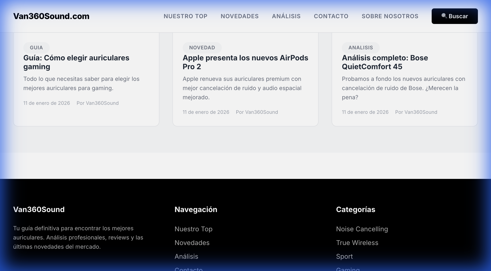

# Página Web Activa: Van360Sound.com

He activado los servidores de backend y frontend. Ya puedes visualizar tu página web con todos los datos dinámicos.

## Servidores en Ejecución

| Componente | Comando | URL de Acceso |
| :--- | :--- | :--- |
| **Frontend (React)** | `npm run dev` | [http://localhost:5173](http://localhost:5173) |
| **Backend (Django)** | `python manage.py runserver` | [http://localhost:8000](http://localhost:8000) |

## Verificación Visual

Aquí tienes una captura de la página principal cargando correctamente los auriculares destacados y los últimos artículos:

## Resumen de Acciones
1.  **Backend:** Iniciado el servidor Django en el puerto 8000.
2.  **Frontend:** Iniciado el servidor Vite en el puerto 5173.
3.  **Verificación:** Comprobado que la API responde correctamente (200 OK) y que el frontend muestra los datos del blog.

> [!TIP]
> Si cierras esta sesión de terminal, los servidores dejarán de funcionar. Para volver a ver la web, recuerda ejecutar los comandos indicados arriba en dos pestañas de terminal diferentes.
